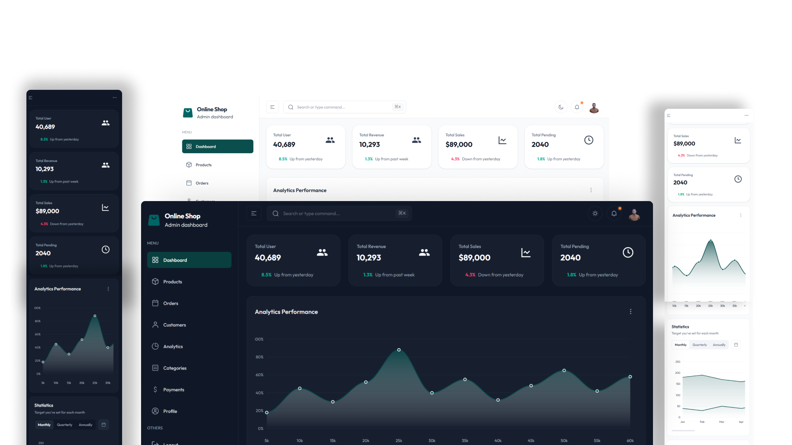

# Ecommerce Admin Dashboard

A modern and responsive **Ecommerce Dashboard** built to monitor, manage, and analyze online store performance. This dashboard provides insights into sales, products, customers, and orders through interactive UI components and data visualization.

### Live Preview
click to see live preview : 
[View Live Website](https://dashboard-seven-chi-22.vercel.app)

## Project Overview

The Ecommerce Dashboard helps store owners and administrators track business performance in real-time. It features a clean UI, responsive design, and useful analytics components to improve decision-making.

This project demonstrates my skills in frontend development, UI/UX design, and dashboard architecture.

## Features

- Sales analytics and performance tracking
- Product management interface
- Customer overview
- Order tracking dashboard
- Interactive charts and statistics
- Dark/Light mode support (optional)
- Fully responsive design
- Fast and optimized UI components

## Technologies Used

- React.js
- Tailwind CSS
- JavaScript (ES6+)
- Chart libraries (ApexCharts / Chart.js)
- Material UI / UI components
- REST API integration (if applicable)

## Purpose of the Project

This project was built to:

- Showcase dashboard UI development skills
- Demonstrate data visualization techniques
- Practice component-based architecture
- Build production-level frontend projects for portfolio

